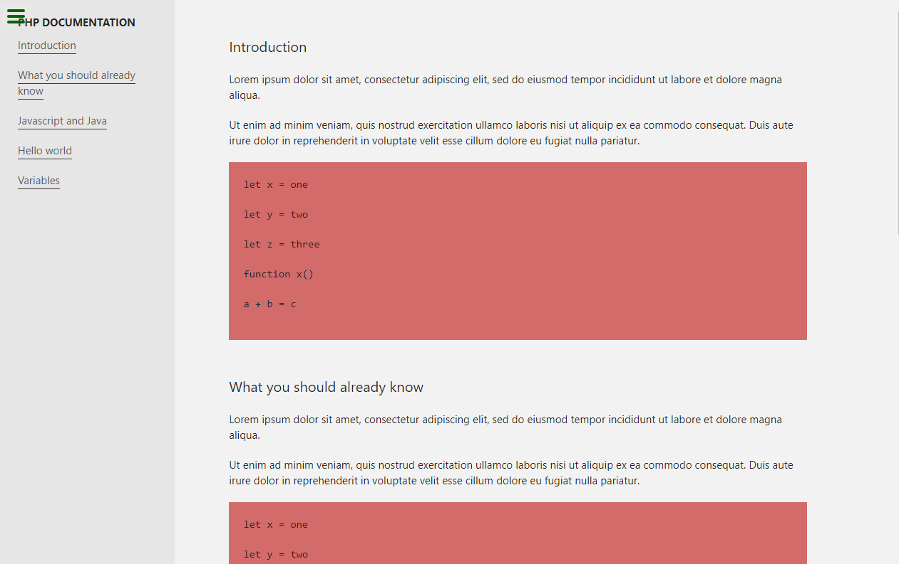

# Technical documentation page build in 2 hours

> The project is a simple technical documentation page build with Html and Css in 2 hours for de admision in the Microverse porgram.

It was build in pair programming with [tijazz](https://github.com/tijazz)
The page is mobile responsive and has the freecodecamp Test Suite added.

## Built With

- HTML,
- CSS

## Live Demo

[Live Demo Link](https://cristianceamatu.github.io/microverse-admision-technical-page/)

To get a local copy up and running follow these simple example steps.

## Setup

Clone the project locally.

### Deployment

Install and run a live server plugin on you IDE/Text editor and run it from the root directory.

## Authors

👤 **Cristian Viorel Ceamatu**

- Github: [@githubhandle](https://github.com/cristianCeamatu)
- Twitter: [@twitterhandle](https://twitter.com/CeamatuV)
- Linkedin: [linkedin](https://www.linkedin.com/in/ceamatu-cristian-viorel-7a5469136/)

## Show your support

Give a ⭐️ if you like this project!

## 📝 License

This project is [MIT](lic.url) licensed.
